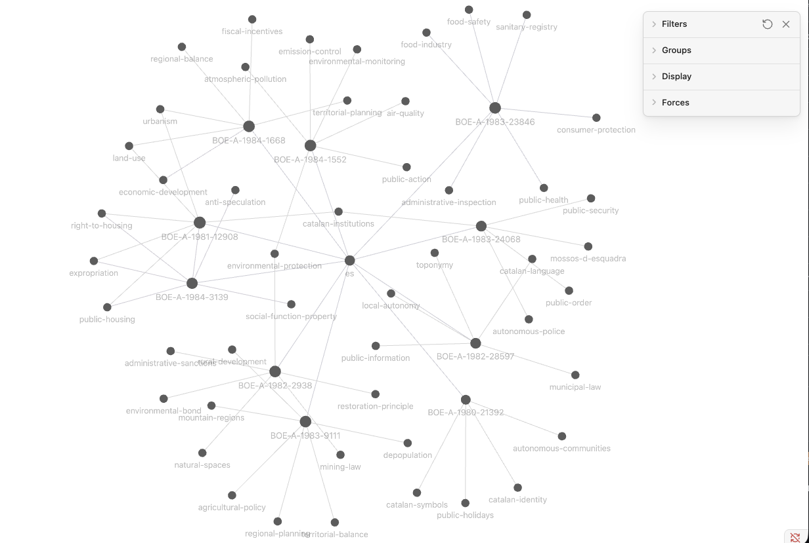

<div align="center">


</div>

<div align="center">

[English](README.md) · **Español**

[](https://opensource.org/licenses/MIT)
[](https://www.python.org/downloads/)
[](https://github.com/astral-sh/uv)
[](https://claude.ai/code)

Una base de conocimiento jurídico que cita el texto original de verdad.

[Comandos Slash](#comandos-slash) • [Arquitectura](#arquitectura) • [Añadir Países](#añadir-un-nuevo-país) • [Seguimiento](#seguimiento) • [Issues](https://github.com/arnabdeypolimi/your-ai-lawyer/issues)

</div>

---

Las leyes oficiales de cada país viven en submódulos de git. Claude Code las lee, escribe un resumen y un grafo de wikilinks en `knowledge/`, y un índice ChromaDB local te permite buscar o preguntar con citas al artículo real. Sin clave de API. Nada sale de tu máquina.

España está lista (12 000+ leyes del BOE). 27 países más están a un `git submodule add` de distancia.

<div align="center">



*Las primeras 10 leyes de Cataluña en la vista de grafo de Obsidian. Los nodos `BOE-A-*` son leyes; los más pequeños son páginas de conceptos compartidas a las que enlazan.*

</div>

---


## Qué obtienes

- Ejecutas `/compile es-ct --limit 10` y Claude lee diez leyes de Cataluña, escribe resúmenes, extrae conceptos y construye los wikilinks.
- El resultado es una bóveda válida de Obsidian. Ábrela en Obsidian y ahí tienes el grafo.
- Dos colecciones ChromaDB: una para los resúmenes compilados, otra para fragmentos de artículos originales. Las consultas buscan en ambas.
- `/qa` responde en prosa con citas del tipo `[BOE-A-XXXX-XXXXX, Art. N]`. Puedes saltar al texto original.
- Al recompilar se omiten los archivos que no han cambiado (comprobación por hash md5). Cada ejecución queda registrada.
- `/lint` detecta huérfanos, wikilinks rotos y notas sin rastrear.

---

## Inicio Rápido

### Instalación

```bash
git clone --recurse-submodules https://github.com/arnabdeypolimi/your-ai-lawyer.git
cd your-ai-lawyer
uv sync
```

Requiere [uv](https://github.com/astral-sh/uv) y [Claude Code](https://claude.ai/code).

### Abrir en Claude Code

```bash
claude .
```

### Elige un idioma (una sola vez)

```bash
/setup            # interactivo
/setup es         # directo
```

De serie: `en`, `es`, `ca`, `fr`, `it`, `de`, `pt`. Cualquier otro código BCP-47 también funciona, simplemente se pasa al modelo tal cual.

La elección se guarda en `.claude/settings.json` como `env.OUTPUT_LANGUAGE`. Los nuevos `/compile` y las respuestas de `/qa` lo recogen al momento. Las notas ya compiladas se quedan en el idioma en el que se escribieron — es a propósito. Cambia el ajuste, ejecuta `/compile <jurisdicción> --force` y las reescribes.

### Compilar algunas leyes

Empieza pequeño. Cataluña con límite 10 es una buena prueba:

```bash
/compile es-ct --limit 10
```

Luego subes. Solo las constitucionales son unos 50 archivos; toda España son 12k+ y querrás ejecutarlo en lotes de varios cientos:

```bash
/compile es --rank constitucion
/compile es
```

### Construir el índice de búsqueda

```bash
/index
/index --country es --compiled-only
```

### Pregúntale algo

```bash
/qa ¿Cuáles son los derechos de vivienda de los inquilinos en España?
/qa ¿Tiene Cataluña sus propias leyes de protección de datos?
/search derecho a la educación --country es --n 10
```

### Comprobación rápida

```bash
/lint
/lint --jurisdiction es-ct
/lint --broken-links
```

---

## Comandos Slash

| Comando | Descripción |
|---------|-------------|
| `/setup [<código-idioma>]` | Selecciona idioma de salida para notas compiladas y `/qa` |
| `/compile <jurisdicción> [--limit N] [--rank R] [--force]` | Compila leyes originales en el grafo de conocimiento |
| `/index [--country X] [--compiled-only] [--raw-only]` | Construye / actualiza el índice vectorial ChromaDB |
| `/search <consulta> [--country X] [--rank R] [--n N]` | Búsqueda semántica con resultados ordenados |
| `/qa <pregunta>` | Respuesta RAG con citas en línea |
| `/lint [--jurisdiction X] [--broken-links]` | Revisión de salud de la base de conocimiento |

Códigos regionales de España: `es` para nacional, más `es-ct`, `es-md`, `es-an`, `es-pv`, `es-ga`, `es-vc`, `es-ib`, `es-ar`, `es-cn`, `es-cl`, `es-cm`, `es-cb`, `es-as`, `es-ri`, `es-nc`, `es-mc` para las 17 comunidades autónomas.

---

## Arquitectura

```
your-ai-lawyer/
├── legalize-es/              # Leyes originales de España (submódulo git, 12K+ archivos)
├── knowledge/                # Bóveda Obsidian compilada
│   ├── laws/es/              # Un .md por ley: resumen, disposiciones, wikilinks
│   ├── concepts/             # Archivos de índice de conceptos con backlinks
│   └── jurisdictions/        # Notas de resumen por país
├── data/
│   ├── index.json            # Estado de compilación por ley
│   ├── compile.log           # Historial de ejecuciones (NDJSON)
│   ├── manifest.json         # Hashes MD5 para detección de cambios
│   └── chroma/               # Almacén vectorial ChromaDB (gitignored)
└── src/
    ├── compiler/             # parser, extractor, batch, tracker, lint
    ├── indexer/              # pipeline de embeddings ChromaDB
    └── query/                # búsqueda semántica
```

### Pipeline de compilación

```
legalize-<país>/
  markdown original + YAML frontmatter
          │
          ▼  /compile (Claude Code lee y escribe directamente)
          │   list_files.py  →  lista archivos que necesitan compilación
          │   tracker.py     →  registra resultado en index.json + compile.log
          │
knowledge/laws/<país>/
  notas compiladas con [[wikilinks]]
          │
          ▼  /index (embeddings ONNX locales — sin clave API)
          │
data/chroma/
  colección compiled + colección raw_chunks
          │
          ▼  /qa o /search
  citas: [BOE-A-XXXX-XXXXX, Art. N]
```

### Cómo se ve una nota compilada

Cada `knowledge/laws/es/<identifier>.md` empieza con frontmatter YAML:

```yaml
---
identifier: BOE-A-1978-31229
title: "Constitución Española"
country: es
jurisdiction: es
rank: constitucion
status: in_force
compiled_at: 2026-04-21
---
```

Después un resumen, las disposiciones clave (en bullets), referencias cruzadas como wikilinks, las relaciones de supersedes/implements si aplica, las etiquetas de concepto, y una ruta de vuelta al archivo original. `knowledge/` es una bóveda válida de Obsidian — apunta Obsidian ahí y el grafo aparece.

---

## Seguimiento

Tres archivos en `data/` rastrean el estado de compilación:

| Archivo | Contenido |
|---------|-----------|
| `manifest.json` | `{ ruta_original: hash_md5 }` — omite archivos sin cambios al recompilar |
| `index.json` | Registro por ley: `status`, `compiled_at`, `note_path`, `error` |
| `compile.log` | Historial NDJSON: marca temporal, jurisdicción, conteos, IDs con error |

Consulta el estado directamente:

```bash
uv run python -m src.compiler.tracker status
uv run python -m src.compiler.tracker status --jurisdiction es-ct
uv run python -m src.compiler.tracker log --n 20
```

---

## Añadir un Nuevo País

Toda la legislación en bruto viene de [legalize-dev](https://github.com/legalize-dev) — un repo por país, Markdown + frontmatter YAML, mantenido por esa organización.

Sustituye `XX` por un código de país de la tabla de abajo y ejecuta:

```bash
git submodule add https://github.com/legalize-dev/legalize-XX.git legalize-XX
git submodule update --init legalize-XX
claude .
/compile XX --limit 20
/index --country XX
/qa ¿Cuáles son los derechos laborales en Francia?
```

Con los grandes (EE. UU. tiene 60k+ secciones, Portugal 109k+ normas) no intentes compilar todo de golpe. Hazlo en lotes por rango legal y mira el tracker de vez en cuando:

```bash
/compile us --rank statute --limit 50
/compile pt --rank lei --limit 50
uv run python -m src.compiler.tracker status --jurisdiction us
```

---

## Países Disponibles

28 países. Eliges uno, lo añades como submódulo, compilas. España es el único ya conectado en este repo — el resto está a un `git submodule add` de distancia.

| País | Código | Submódulo | Leyes | Fuente |
|------|--------|-----------|-------|--------|
| 🇦🇩 Andorra | `ad` | `legalize-ad` | — | BOPA |
| 🇦🇷 Argentina | `ar` | `legalize-ar` | — | Infoleg |
| 🇦🇹 Austria | `at` | `legalize-at` | — | RIS |
| 🇧🇪 Bélgica | `be` | `legalize-be` | — | Justel |
| 🇨🇱 Chile | `cl` | `legalize-cl` | — | BCN / Ley Chile |
| 🇨🇿 República Checa | `cz` | `legalize-cz` | — | ⚠️ En desarrollo |
| 🇩🇰 Dinamarca | `dk` | `legalize-dk` | — | retsinformation.dk |
| 🇪🇪 Estonia | `ee` | `legalize-ee` | — | Riigi Teataja |
| 🇫🇮 Finlandia | `fi` | `legalize-fi` | — | Finlex |
| 🇫🇷 Francia | `fr` | `legalize-fr` | — | Légifrance |
| 🇩🇪 Alemania | `de` | `legalize-de` | — | gesetze-im-internet.de |
| 🇬🇷 Grecia | `gr` | `legalize-gr` | — | ΦΕΚ Α' |
| 🇮🇪 Irlanda | `ie` | `legalize-ie` | — | legislation.ie |
| 🇮🇹 Italia | `it` | `legalize-it` | — | Normattiva |
| 🇰🇷 Corea del Sur | `kr` | `legalize-kr` | — | 국가법령정보센터 |
| 🇱🇻 Letonia | `lv` | `legalize-lv` | — | likumi.lv |
| 🇱🇹 Lituania | `lt` | `legalize-lt` | — | TAR / data.gov.lt |
| 🇱🇺 Luxemburgo | `lu` | `legalize-lu` | — | legilux.lu |
| 🇳🇱 Países Bajos | `nl` | `legalize-nl` | — | Basis Wetten Bestand |
| 🇳🇴 Noruega | `no` | `legalize-no` | — | Lovdata (NLOD 2.0) |
| 🇵🇱 Polonia | `pl` | `legalize-pl` | — | Sejm / Dziennik Ustaw |
| 🇵🇹 Portugal | `pt` | `legalize-pt` | 109K+ | Diário da República |
| 🇸🇰 Eslovaquia | `sk` | `legalize-sk` | — | Slov-Lex |
| 🇪🇸 España | `es` | `legalize-es` ✅ | 12K+ | BOE |
| 🇸🇪 Suecia | `se` | `legalize-se` | — | riksdagen.se |
| 🇺🇦 Ucrania | `ua` | `legalize-ua` | — | Verkhovna Rada |
| 🇬🇧 Reino Unido | `gb` | — | — | Próximamente |
| 🇺🇸 Estados Unidos | `us` | `legalize-us` | 60K+ | US Code |
| 🇺🇾 Uruguay | `uy` | `legalize-uy` | — | IMPO |

✅ = ya añadido como submódulo · ⚠️ = en desarrollo activo, la estructura puede cambiar

---

## Contribuir

Primero issue, luego PR. Lo más útil ahora mismo: añadir un submódulo de un país nuevo, afinar los prompts de compilación, mejorar el linter, o escribir un extractor más fino para un rango legal concreto.

## Agradecimientos

Sin [legalize-dev](https://github.com/legalize-dev) nada de esto funciona. Ellos son quienes scrapean, limpian y versionan las publicaciones oficiales del gobierno a Markdown; este repo solo compila un grafo encima. Cada submódulo de país se mantiene allá bajo su propia licencia.

## Condiciones de Uso

Solo uso personal y no comercial.

Esto no es asesoramiento legal. No soy abogado. Los resúmenes compilados y las respuestas de Q&A las genera un modelo de lenguaje a partir de fuentes gubernamentales públicas, que pueden estar desactualizadas o incompletas, y el modelo se puede equivocar. Si estás tomando una decisión que importa, habla con un abogado de verdad y verifícalo contra la fuente original a la que apuntan las citas.

Al usar esto aceptas que:
- No lo usarás comercialmente sin arreglar tú mismo las licencias aguas arriba
- Los mantenedores no son responsables de lo que salga mal
- Las leyes cambian. Las notas compiladas son una foto fija, no el estado actual

## Licencia

MIT para el código. Los textos legales en los submódulos son de dominio público (publicaciones oficiales gubernamentales) — revisa cada submódulo para los detalles.
